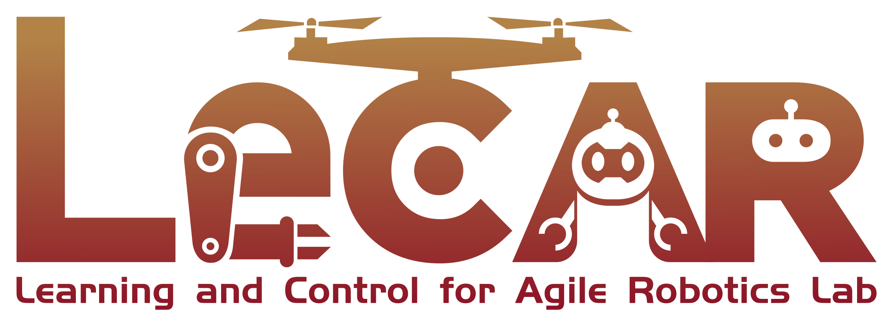
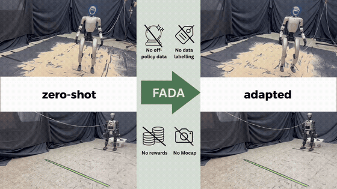
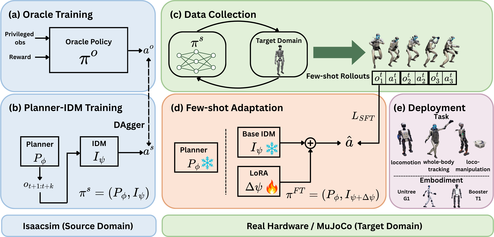

<h1 align="center">FADA: Few-Shot Domain Adaptation via Dynamics Alignment for Humanoid Control</h1>

<p align="center"><b>Conference on Robot Learning (CoRL) 2026</b></p>

<div align="center">

[[Website]](https://lecar-lab.github.io/FADA-humanoid/)
[[arXiv]](https://arxiv.org/abs/2606.28476)
[[Video]](https://lecar-lab.github.io/FADA-humanoid/videos/fada-overview.mp4)

 &nbsp; &nbsp; &nbsp; &nbsp; &nbsp; &nbsp; &nbsp; &nbsp; 

[](https://docs.isaacsim.omniverse.nvidia.com/) [](https://mujoco.org/) [](https://releases.ubuntu.com/22.04/) [](LICENSE)



</div>

**FADA** is a few-shot domain adaptation framework for humanoid control, adapting a trained
policy to new real-world dynamics, e.g. a payload, a slope, unfamiliar terrain, using about two
minutes of target-domain data, with no rewards, no motion capture, and no policy retraining.

## Status

- [x] Training code (oracle PPO + Planner-IDM DAgger distillation)
- [x] Finetuning code (IDM LoRA on target-domain data)
- [x] Sim2sim code (MuJoCo deployment and data collection)
- [x] Sim2real code (real-robot deployment and data collection)
- [x] Oracle checkpoints (T1, G1)
- [ ] Whole-body tracking

This repository is derived from [Holosoma](https://github.com/amazon-far/holosoma) (Apache-2.0, Amazon FAR).
FADA's additions live under `src/holosoma/holosoma/fada/` and, on the inference side,
`LocomotionPolicy_FADA`. This README covers the FADA pipeline only; the unchanged upstream
subsystems have their own guides ([training](src/holosoma/README.md),
[inference](src/holosoma_inference/README.md),
[retargeting](src/holosoma_retargeting/holosoma_retargeting/README.md)), or see the
[upstream repository](https://github.com/amazon-far/holosoma) itself.

## Repository Structure

```
src/
├── holosoma/              # Core training framework
│   └── holosoma/fada/     # FADA: Planner-IDM model, DAgger training, IDM LoRA finetuning
├── holosoma_inference/    # Inference and deployment (LocomotionPolicy_FADA)
└── holosoma_retargeting/  # Motion retargeting (inherited from upstream)
```

## Setup

Each stage runs in its own environment. Install the ones the steps below use:

```bash
# IsaacSim, for FADA steps 1, 2, 3 and 5
# Requires Ubuntu 22.04 or later due to IsaacSim dependencies
bash scripts/setup_isaacsim.sh

# MuJoCo, the simulator side of steps 4 and 6
bash scripts/setup_mujoco.sh

# ONNX inference, the policy side of steps 4 and 6
bash scripts/setup_inference.sh
```

`scripts/setup_isaacgym.sh` and `scripts/setup_retargeting.sh` are also present, for the
inherited subsystems above.

Run every command below from the repository root, after sourcing the environment shown at
the top of its block.

## FADA Pipeline



Six steps end to end: oracle training, DAgger distillation into a Planner-IDM student, evaluation
and ONNX export, MuJoCo/hardware deployment and data collection, IDM finetuning, and a final
pre/post comparison on identical command sequences.

The commands below carry only your own paths. Every hyperparameter is a flag, so run any entry
point with `--help` to see it.

### 1. Train the oracle PPO expert

Step 1 should use an **oracle** preset (`g1_29dof_oracle`, `t1_23dof_waist50_oracle`).

```bash
source scripts/source_isaacsim_setup.sh
python src/holosoma/holosoma/train_agent.py \
    exp:g1_29dof_oracle \
    simulator:isaacsim \
    logger:wandb \
    --logger.base-dir logs/g1_oracle
#    -> logs/g1_oracle/<oracle-run>/
```

For T1, swap in `exp:t1_23dof_waist50_oracle` and `--logger.base-dir logs/t1_oracle`.

### 2. Train the FADA (Planner-IDM) student via DAgger

`--expert-checkpoint` must point into a directory holding **every** intermediate `model_*.pt`
from the oracle run. Released oracle checkpoints: <https://huggingface.co/AngchenXie/fada-checkpoints>.
DAgger reward-samples twenty of them for its weak-policy data; pass `--suboptimal-data-ratio 0` to
skip that source, and `--expert-checkpoint` only needs to point at the single checkpoint you
want to imitate (e.g. the final one), not the full directory.

```bash
python -m holosoma.fada.planner_idm.train \
    --expert-checkpoint logs/g1_oracle/<oracle-run>/model_24999.pt
#    -> <dagger-run>/, i.e. logs/g1_oracle/<oracle-run>_fada_dagger/<run>/
```

Same command for T1, just point `--expert-checkpoint` at your T1 oracle run.

### 3. Evaluate the checkpoint and export ONNX

Check here that the DAgger student actually works, e.g. walks stably, before moving on to
deployment.

```bash
python -m holosoma.fada.planner_idm.eval_checkpoint \
    --checkpoint <dagger-run>/model_final.pt
#    -> <dagger-run>/eval/dagger_eval/planner_idm_policy.onnx
```

### 4. Deploy in MuJoCo and collect target-domain data

Two terminals. **Terminal A** is the simulator and its viewer:

```bash
source scripts/source_mujoco_setup.sh
python src/holosoma/holosoma/run_sim.py robot:g1-29dof
```

For T1, use `robot:t1-23dof-waist-wrist`.

The preset holds the robot on a virtual gantry, and it never releases itself. The viewer prints
the keys: `8` lowers the robot, `7` raises it, `9` releases. Lower it until the feet reach the
ground and take load, start **Terminal B**, and press `9` as the policy comes up; recording
begins at the policy's first step.

```bash
source scripts/source_inference_setup.sh
python3 src/holosoma_inference/holosoma_inference/run_policy.py inference:g1-29dof-loco-fada \
    --task.model-path <dagger-run>/eval/dagger_eval/planner_idm_policy.onnx \
    --task.seed 42 \
    --task.max-steps 5000 \
    --task.auto-start-policy \
    --task.collect-data \
    --task.log-output-dir logs/mujoco_collect/g1_loco
#    -> logs/mujoco_collect/g1_loco/<timestamp>/dataset.h5
```

For T1, use `inference:t1-23dof-loco-fada` and `--task.log-output-dir logs/mujoco_collect/t1_loco`.

**On hardware, the same pipeline runs against the robot**: the H5 it collects feeds step 5 exactly
as the MuJoCo one does, so the robot itself becomes the target domain. **Get the pipeline working
in MuJoCo first.**

```bash
python3 src/holosoma_inference/holosoma_inference/run_policy.py inference:g1-29dof-loco-fada \
    --task.model-path <onnx> \
    --task.interface eno1 \
    --task.no-randomize-commands \
    --task.collect-data \
    --task.max-steps 5000
```

No gantry, no Terminal A: `--task.interface` is the robot's network interface, and
`--task.no-randomize-commands` turns off the MuJoCo preset's sampling so you drive it yourself,
from a joystick or the keyboard.

Hardware setup and the control reference are in
[`docs/workflows/real-robot-locomotion.md`](src/holosoma_inference/docs/workflows/real-robot-locomotion.md).
For T1, use `inference:t1-23dof-loco-fada`, and follow the doc's procedure rather than the
preset's: its T1 section uses `inference:t1-29dof-loco`, while FADA's T1 is 23-DoF.

### 5. Finetune the IDM on target-domain data

```bash
source scripts/source_isaacsim_setup.sh
python -m holosoma.fada.planner_idm.finetune_idm_lora \
    --checkpoint <dagger-run>/model_final.pt \
    --target-datasets logs/mujoco_collect/g1_loco/<timestamp>/dataset.h5
#    -> <dagger-run>/finetune/<sft-run>/planner_idm_policy.onnx
```

Same command for T1, just point `--target-datasets` at your T1 dataset.

### 6. Collect matched pre-SFT and post-SFT rollouts

This step produces the two rollouts a comparison would be made from; it does not compare them.
What to measure, and how, is left to you.

Run step 4's policy command twice, once per ONNX, with the same `--task.seed` and
`--task.max-steps`, no `--task.collect-data`, and its own `--task.log-output-dir`:

| Run | `--task.model-path` | `--task.log-output-dir` |
|---|---|---|
| pre-SFT | `<dagger-run>/eval/dagger_eval/planner_idm_policy.onnx` | `logs/step6/pre_sft` |
| post-SFT | `<dagger-run>/finetune/<sft-run>/planner_idm_policy.onnx` | `logs/step6/post_sft` |

In MuJoCo, restart Terminal A between the two runs and use the same gantry length for both.
On hardware the equivalent is the same robot, the same starting pose, and the same command
input. Each run writes `mocap_unified.npz` under `--task.log-output-dir`, recording base
positions and orientations, the commands, and their timestamps.

## Citation

This repository is the code release for **FADA** (arXiv:2606.28476). If you use it in your
research, please cite the paper:

```bibtex
@article{xie2026fada,
  title   = {FADA: Few-Shot Domain Adaptation via Dynamics Alignment for Humanoid Control},
  author  = {Xie, Angchen and Sobanbabu, Nikhil and Shikhare, Ishayu and Wang, Alan
             and Simchowitz, Max and Shi, Guanya},
  journal = {arXiv preprint arXiv:2606.28476},
  year    = {2026},
  doi     = {10.48550/arXiv.2606.28476}
}
```

FADA is built on top of **Holosoma** (Amazon FAR, Apache-2.0), which provides the training,
evaluation and deployment framework this work extends. Please cite it alongside FADA, using the
"Cite this repository" panel on the [Holosoma repository](https://github.com/amazon-far/holosoma).

## License

This project is licensed under the Apache-2.0 License.
